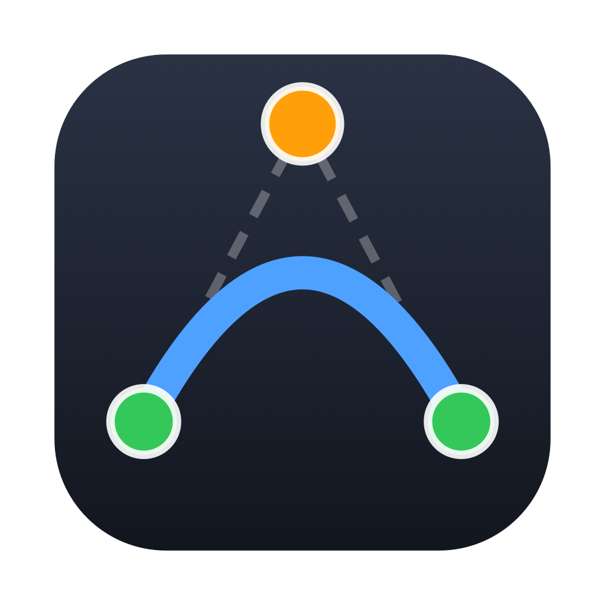
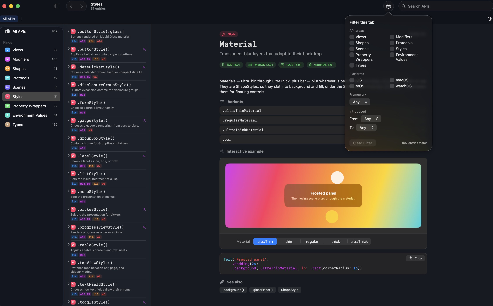
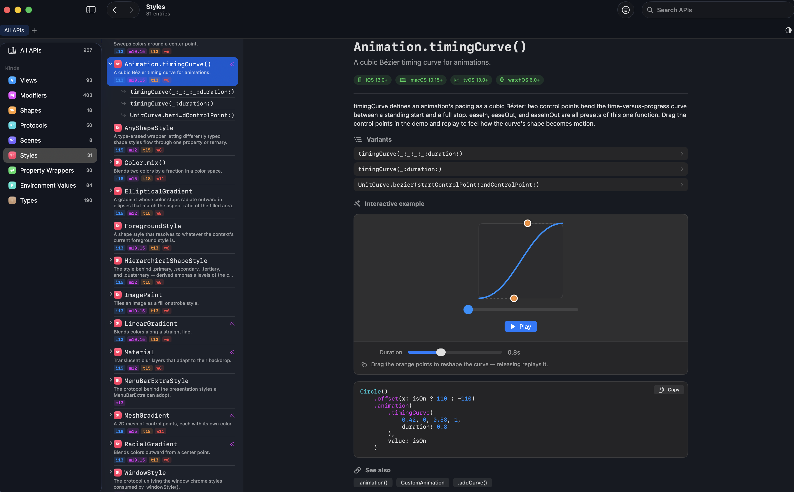

#  Aviary

An interactive documentation browser for SwiftUI.

<table>
  <tr>
    <td></td>
    <td></td>
  </tr>
</table>

The catalog spans **907 topics and 1,455 sub-entries (2,362 pages)** covering
SwiftUI views, modifiers, shapes, protocols, scenes, styles, property wrappers,
environment values, and supporting types, from the 2019 debut through WWDC 2025,
across iOS, macOS, tvOS, and watchOS.

> **Independent project.** This is an original, from-scratch build. It reproduces
> the general *idea* of an interactive SwiftUI reference, but shares no code,
> content, or assets with any App Store product, and is not affiliated with or
> endorsed by Apple. "SwiftUI" and "Swift" are trademarks of Apple Inc.

## Features

- **Every entry has a visualization.** 49 interactive demos plus 858 compiled
  usage examples — nothing is a bare code listing. Where an API can't run in a
  window (App Store paywalls, live map tiles), the page shows a faithful,
  clearly-labeled illustration beside the real code.
- **Every variant has its own live example.** Each of the 1,455 sub-entries —
  a specific initializer, overload, nested type, or static member — has a
  compiled rendering that exercises exactly that form, with the code the view
  was built from. Selecting a variant swaps its example into the page in place,
  so the topic's header, discussion, and scroll position stay put.
- **Interactive, drag-first demos.** The flagships let you *feel* the API:
  drag the control points of a quadratic or cubic Bézier curve, the anchors of
  a gradient, the light source behind a shadow, or the sweep of an angular
  gradient — and watch the generated code update to match.
- **Copy-ready code.** Every example's code panel copies to the clipboard,
  syntax-highlighted, ready to paste into Xcode.
- **Workspace tabs with independent filters.** Each tab has its own filter over
  API area, platform, framework, and WWDC-year range, plus its own search and
  selection — so you can keep "everything new since WWDC '24" open next to
  "just the shapes."
- **Menu bar quick search.** A menu bar icon opens a type-ahead search that
  jumps the main window straight to any entry or sub-entry.
- **Back / forward history.** Per-tab navigation history with ⌘[ and ⌘],
  restoring both the entry and the context you viewed it in.
- **Light / dark / system appearance toggle,** persisted across launches.

## Requirements

- macOS 26 or later
- Xcode 26 or later

## Build & run

```bash
git clone https://github.com/TheBCann/Aviary.git
cd Aviary
open Aviary.xcodeproj
```

Select the **Aviary** scheme and run (⌘R). To run the test suite:

```bash
xcodebuild test -scheme Aviary -destination 'platform=macOS'
```

## How it's built

The app is a layered, dependency-free SwiftUI project with one deliberate design
choice at its center: **the catalog is data, not code.**

- **Catalog** — every documented API lives as JSON in
  [`CatalogData/`](Aviary/CatalogData), decoded
  into a `Codable` `Topic` at launch. Adding or editing an entry is a JSON edit;
  the app never recompiles for content. A `Topic` carries its kind, summary,
  discussion, example code, per-platform availability (derived from its WWDC
  year), framework, and sub-entries.
- **Rendered examples** — each domain contributes a file of compiled example
  views in [`Examples/`](Aviary/Examples).
  `ExampleRegistry` aggregates them, and a topic's page shows, in order of
  preference: its interactive demo, its rendered example, then static code.
- **Variant renderings** — the `ChildExamples+PartNN.swift` files hold one
  compiled view per sub-entry, keyed by `"<topic> › <variant>"` and aggregated
  by `ChildExampleRegistry`. When a variant is selected, its rendering and code
  replace the topic's example region; everything else on the page is unchanged.
- **Interactive demos** — `DemoRegistry` maps a topic's `demoID` to a live,
  parameterized demo whose controls drive a real view *and* regenerate the
  displayed code, so the two never disagree.
- **Tests** — 32 tests guard the data layer: catalog integrity (every entry
  decodes, ids are unique, every `demoID` resolves, availability is derivable),
  filter logic, navigation history, the `Codable` round trip, and full
  visualization coverage — the build fails if any topic lacks a demo or example,
  or if any variant lacks a rendering or names a variant that doesn't exist.

### Frameworks referenced

Beyond SwiftUI itself, the catalog documents the SwiftUI-facing surface of
Swift Charts, MapKit, SwiftData, StoreKit, TipKit, PhotosUI, WidgetKit,
WebKit, AVKit, SpriteKit, SceneKit, QuickLook, and more — each entry noting the
module it requires.

## Adding to the catalog

Because the catalog is JSON, contributions are mostly data:

1. Add or edit an entry in the appropriate `CatalogData/*.json` file.
2. If it warrants a rendered example, add one to the matching
   `Examples/Examples+*.swift` file (a compiled SwiftUI view plus the code it
   corresponds to). A new sub-entry needs a `ChildExampleEntry` in one of the
   `Examples/ChildExamples+Part*.swift` files — the coverage test will name any
   variant that lacks one.
3. Run the tests — the integrity and coverage checks will tell you if anything
   is missing or inconsistent.

## License

Released under the [MIT License](LICENSE).
